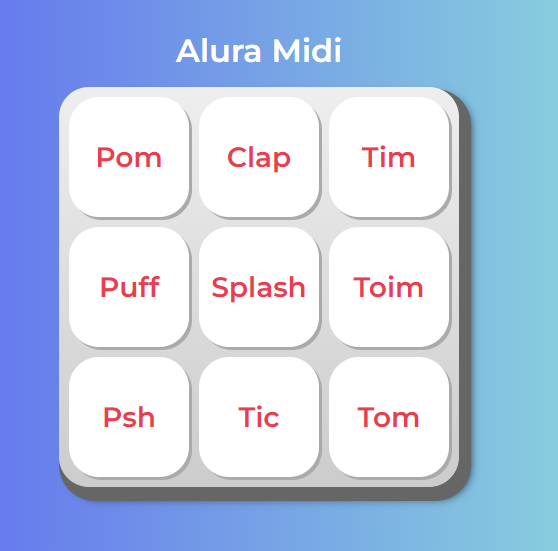

# 🎹 Tecla Musical Web

Aplicación web interactiva desarrollada con **HTML, CSS y JavaScript** que reproduce sonidos al hacer clic en botones tipo tecla, simulando un instrumento musical.

## 🚀 Funcionalidades

- Reproduce sonidos de instrumentos musicales al presionar teclas.
- Manipulación del DOM (estilos, textos, clases) con JavaScript.
- Interacción con el usuario a través de eventos como `onclick`.
- Uso de etiquetas de audio y control dinámico.

## 🌐 Ver en línea

Puedes acceder a la aplicación desde el siguiente enlace:  
👉 [https://TU-URL-AQUÍ.com](https://gutierrezcesar.github.io/Tecla-Musical-Web/)

## 🛠️ Tecnologías usadas

- HTML5
- CSS3
- JavaScript (puro)

## 📁 Estructura del proyecto

/tecla-musical-web
│
├── /css
├── /imagenes
├── /sonidos
└── index.html
└── main.js

## 📌 Objetivo del proyecto

Este proyecto fue desarrollado con fines educativos para:

- Aprender a manipular el DOM con JavaScript.
- Integrar audio en una interfaz web.
- Crear experiencias interactivas con eventos simples.

---
